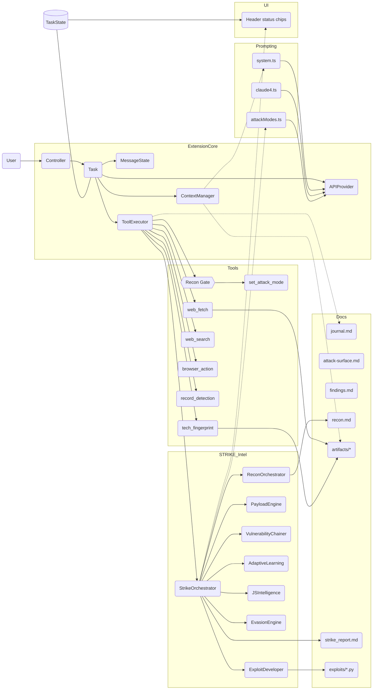

# Strike – Autonomous Penetration Testing Agent for VS Code

Strike transforms the Cline extension into an operator-grade penetration testing agent. It embeds a stealth-first doctrine, a recon → verify → exploit workflow, cost-aware context management, and continuous documentation for professional bug bounty and red team operations.

- Focus: reconnaissance, scanning/fuzzing, vulnerability assessment, controlled exploitation, reporting
- Mindset: stealth, hypothesis-driven attacks, minimal PoC, strong audit trail
- UI: dark blue hacker aesthetic and “Strike” branding

## Why Strike (vs Cline)

- Pentest-first prompts: doctrine, phased methodology, attacker mindset, documentation standards
- Documentation pipeline: auto-creates `docs/pentest/` (journal, attack-surface, findings, artifacts)
- Context digests: compact tails of docs appended to the system prompt; artifacts referenced by path
- Efficient browser/research usage; minimal Python PoCs (requests/asyncio/selenium) with safety guards

## Architecture Overview



## From GitHub to Running (Clean Setup)

Prereqs
- Node 18.x or 20.x (recommended: 18.19+). Use `nvm` if possible
- VS Code 1.93+
- Git and Git LFS
- macOS: Homebrew installed for optional pentest tools

1) Clone and switch to the `pentest-features` branch

```bash
# Clone
git clone <YOUR_FORK_OR_REPO_URL> Strike
cd Strike/cline

# Ensure Git LFS (first time on a machine)
brew install git-lfs  # macOS
# or: sudo apt-get install git-lfs  # Debian/Ubuntu
# or: sudo pacman -S git-lfs        # Arch

git lfs install
# Pull LFS files if needed
git lfs pull

# Switch branch
git checkout pentest-features
```

2) Install dependencies (root and webview)

```bash
# Root
npm install

# Webview
cd webview-ui
npm install
cd ..
```

3) Build webview and extension

```bash
# Build the webview (Vite)
npm run build:webview

# Build the extension (esbuild)
npm run build
```

4) Launch in VS Code (Extension Development Host)
- Open the `Strike/cline` folder in VS Code
- Press F5 (Run Extension). A new VS Code window opens with Strike installed

Alternative: Package and install as VSIX

```bash
# Create VSIX
npx vsce package --no-dependencies
# Install the VSIX in VS Code: Command Palette → "Extensions: Install from VSIX..."
```

5) Configure your model/API provider
- In the Extension Host window, open Strike/Cline settings
- Provide the required API key(s) for your model provider and enable browser/tool usage as desired

6) (Optional) Install pentest CLI tools

```bash
# macOS (Homebrew), Debian/Ubuntu (apt), or Arch (pacman) supported by the script
npm run pentest:install
npm run pentest:verify
```

Notes
- Strike writes documentation to `docs/pentest/` in your workspace (journal, attack surface, findings, artifacts)
- Large outputs and fetched pages are saved under `docs/pentest/artifacts/`, and referenced in the conversation to save tokens

## Usage

### Elite-Level Autonomous Pentesting

Strike now features **STRIKE Intelligence** - an advanced AI system that transforms basic vulnerability discovery into elite-level autonomous pentesting:

**🧠 Intelligent Recon**: Auto-populates `recon.md` with comprehensive intelligence from tech fingerprinting, JS analysis, and endpoint discovery; `set_attack_mode` is gated until `recon.md` meets minimum content threshold

**🎯 Context-Aware Payloads**: Generates smart payloads adapted to detected technology stack, WAF signatures, and previous failures  

**⛓️ Vulnerability Chaining**: Automatically identifies how individual findings can be chained into critical attack paths

**📚 Adaptive Learning**: Learns from failed attempts and builds target-specific profiles for improved success rates

**🥷 Smart Evasion**: Implements advanced rate limiting, WAF bypass variations, and traffic randomization

**💥 Exploit Development**: Transforms basic PoCs into weaponized, multi-stage exploits with anti-detection features

### Basic Workflow

1) **Start Assessment**: "Conduct elite-level pentest of target X"
2) **STRIKE Orchestration**: The system will automatically:
   - Execute intelligent reconnaissance and populate `recon.md`
   - Analyze JavaScript for hidden endpoints and secrets
   - Build target-specific attack surface maps
   - Generate context-aware payloads with evasion techniques
   - Chain vulnerabilities into high-impact attack scenarios
   - Develop weaponized exploits with full documentation

3) **Elite CTF/Pentester Flow**:
   - `tech_fingerprint` → STRIKE analyzes tech stack and auto-populates intelligence
   - `web_search` → STRIKE learns from top hacker writeups and CTF techniques
   - `javascript_intel` → STRIKE extracts API routes, secrets, and framework details
   - `set_attack_mode` → STRIKE provides intelligent recommendations with confidence scores (gated by recon)
   - `record_detection` → STRIKE adapts future payloads based on detected protections
   - Attack chains automatically discovered and exploited

## Documentation & Audit Trail

`docs/pentest/` contains:
- `journal.md`: timestamped actions, commands, and summaries with evidence links
- `attack-surface.md`: host → ports → tech → auth → notes
- `findings.md`: structured entries (severity, impact, steps, PoC, remediation)
- `artifacts/`: large outputs and research files

## Troubleshooting

- Missing Git LFS artifacts
  - Install and initialize: `git lfs install` then `git lfs pull`
  - On macOS: `brew install git-lfs`

- Webview not updating
  - Rebuild webview: `npm run build:webview`
  - Then rebuild extension: `npm run build`

- Node version issues
  - Use Node 18.x (recommended). With `nvm`: `nvm install 18 && nvm use 18`

- Packaging fails (vsce not found)
  - Use `npx vsce package --no-dependencies` to avoid global install

- Model provider image/doc limits (e.g., Bedrock “too many images”)
  - Strike caps images per response and reduces screenshot size; if you still hit limits, reduce browser actions or close/relaunch to avoid accumulating screenshots in a single turn.

- Permissions or noisy network scans
  - Strike defaults to stealth; it will ask before high-impact actions. Only test within authorized scope.

## Core Components

- `src/core/prompts/system.ts`: Strike doctrine, phased workflow, context usage, PoC guidance
- `src/core/prompts/model_prompts/claude4.ts`: Model-specific pentest prompt & cost-aware guidance
- `src/core/prompts/attackModes.ts`: Mode-specific sections (evidence-driven routing)
- `src/core/context/context-management/ContextManager.ts`: Builds compact digest from pentest docs and appends to system prompt
- `src/core/task/index.ts`: Injects attack-mode section & digest per request
- `src/core/task/ToolExecutor.ts`: Executes tools (`tech_fingerprint`, `web_search`, `web_fetch`, `set_attack_mode`, `record_detection`, `browser_action`)

## Context Window Strategy

- Inject a compact context digest from pentest docs (recon/attack‑surface/findings/journal tails) instead of raw logs
- Dynamic token‑scaled budgets: tail sizes are automatically sized to the current model's context window to minimize cost
- Reference artifact paths; inline only short key lines
- On phase shifts, condense prior phase and keep active target state + hypotheses

## UI Ergonomics

- Header status chips show Mode, Recon state, and detected protections (WAF/CSP/Rate‑limit)
- Subtle glow accents for “hacker‑friendly” readability; purely visual, no logic impact

## Safety & Ethics

- Operate within authorized scope
- Prefer passive → low-and-slow active recon
- Verify with minimal PoC before escalation
- Document all actions and provide remediation guidance

## Roadmap (Selected)

- Perplexity & GitHub research adapters
- Safe runners for nmap/masscan/amass/ffuf/nuclei/dalfox/sqlmap/hydra/nikto
- Summarizers for larger tool outputs; priority-based findings injection
- Deeper JS intelligence (source maps, router heuristics, API schema extraction)

## Licensing & Attribution

This repository is a derivative work of the Cline project. The upstream project’s license included in this repository is Apache License 2.0 (see `LICENSE`). In practical terms:

- Commercial use is permitted
- Attribution and inclusion of the original license are required
- No copyleft requirements (you may distribute derivatives under different terms, provided Apache 2.0 conditions are met)
- Fork-friendly and redistribution-friendly

Compliance steps for this repository:
- Retain the original `LICENSE` file (Apache 2.0) from Cline in the repository
- Preserve attribution in documentation (this README) and any NOTICE-equivalent files
- Maintain existing license notices in source files where present
- Add your own copyright notice for new code contributed

If your distribution adds additional components under different terms, clearly indicate the licensing for those components in their directories and in the documentation.

## License

Apache 2.0 — see `LICENSE`. Strike modifications are provided under the same license unless otherwise noted.
