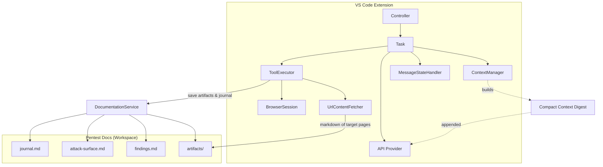

# Strike – Autonomous Penetration Testing Agent for VS Code

Strike transforms the Cline extension into an operator-grade penetration testing agent. It embeds a stealth-first doctrine, a recon → verify → exploit workflow, cost-aware context management, and continuous documentation for professional bug bounty and red team operations.

- Focus: reconnaissance, scanning/fuzzing, vulnerability assessment, controlled exploitation, reporting
- Mindset: stealth, hypothesis-driven attacks, minimal PoC, strong audit trail
- UI: dark blue hacker aesthetic and “Strike” branding

## Why Strike (vs Cline)

- Pentest-first prompts: doctrine, phased methodology, attacker mindset, documentation standards
- Documentation pipeline: auto-creates `docs/pentest/` (journal, attack-surface, findings, artifacts)
- Context digests: compact tails of docs appended to the system prompt; artifacts referenced by path
- Efficient browser/research usage; minimal Python PoCs (requests/asyncio/selenium) with safety guards

## Architecture Overview



## Core Components

- `src/core/prompts/system.ts`: Strike doctrine, phased workflow, context usage, PoC guidance
- `src/core/prompts/model_prompts/claude4.ts`: Model-specific pentest prompt & cost-aware guidance
- `src/core/pentest/DocumentationService.ts`: Creates/updates pentest docs; artifact saver; journaling API
- `src/core/context/context-management/ContextManager.ts`: Builds compact digest from pentest docs and appends to system prompt
- `src/core/task/index.ts`: Injects digest into system prompt per request
- `src/core/task/ToolExecutor.ts`: On `web_fetch`, saves content as artifact, journals action, returns short summary with path

## Getting Started

Prerequisites: Node 18+, VS Code 1.93+, git-lfs (if needed).

1) Install dependencies

```bash
npm install
```

2) Build

```bash
npm run build
```

3) Launch the extension
- Press F5 in VS Code to run the extension in a new window, or package as VSIX if needed.

## Usage

1) Start a task (e.g., “Map the attack surface for target X”).
2) Approve tool calls. Strike will:
   - Save large outputs as artifacts under `docs/pentest/artifacts/`
   - Update `journal.md` and `attack-surface.md`
   - Keep the LLM prompt lean with compact digests
3) For exploitation, let Strike generate minimal PoCs, review them, and approve as appropriate.

## Documentation & Audit Trail

`docs/pentest/` contains:
- `journal.md`: timestamped actions, commands, and summaries with evidence links
- `attack-surface.md`: host → ports → tech → auth → notes
- `findings.md`: structured entries (severity, impact, steps, PoC, remediation)
- `artifacts/`: large outputs and research files

## Context Window Strategy

- Inject a compact context digest from pentest docs rather than raw logs
- Reference artifact paths; inline only short key lines
- On phase shifts, condense prior phase and keep active target state + hypotheses

## Safety & Ethics

- Operate within authorized scope
- Prefer passive → low-and-slow active recon
- Verify with minimal PoC before escalation
- Document all actions and provide remediation guidance

## Roadmap (Selected)

- Phase awareness in state + “Active Hypotheses & Next Steps” injection
- Perplexity & GitHub research adapters
- Safe runners for nmap/masscan/amass/ffuf/nuclei/dalfox/sqlmap/hydra/nikto
- Summarizers for larger tool outputs; priority-based findings injection

## Licensing & Attribution

This repository is a derivative work of the Cline project. The upstream project’s license included in this repository is Apache License 2.0 (see `LICENSE`). In practical terms:

- Commercial use is permitted
- Attribution and inclusion of the original license are required
- No copyleft requirements (you may distribute derivatives under different terms, provided Apache 2.0 conditions are met)
- Fork-friendly and redistribution-friendly

Compliance steps for this repository:
- Retain the original `LICENSE` file (Apache 2.0) from Cline in the repository
- Preserve attribution in documentation (this README) and any NOTICE-equivalent files
- Maintain existing license notices in source files where present
- Add your own copyright notice for new code contributed

If your distribution adds additional components under different terms, clearly indicate the licensing for those components in their directories and in the documentation.

## License

Apache 2.0 — see `LICENSE`. Strike modifications are provided under the same license unless otherwise noted.
